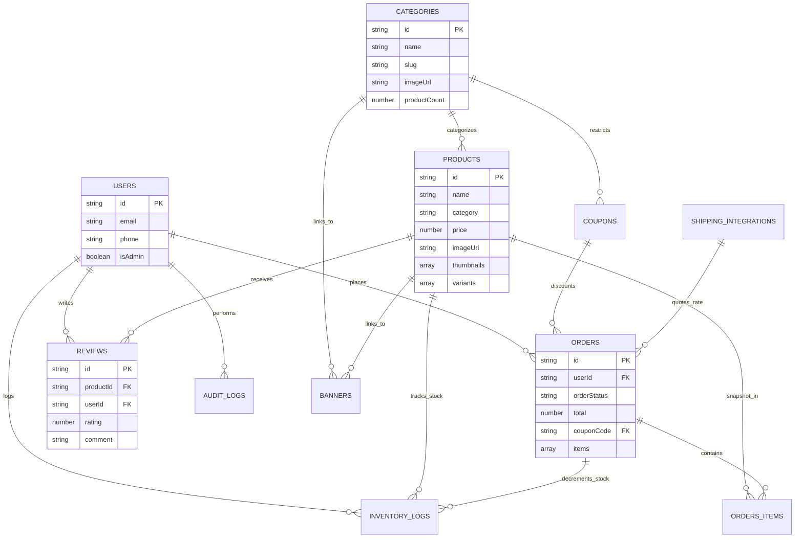

# Punnagai Toy Store — Database Schema & Architecture

This document provides a comprehensive specification of the database architecture, Firestore collections, document schemas, entity relationships, and media storage mechanisms powering the Punnagai Toy Store web application.

---

## 1. Architecture Overview

Punnagai Toy Store uses a **single Cloud Firestore database** (`(default)`) as its primary operational data store, paired with **Firebase Storage** for media binaries and **Firebase Authentication** for user identity.

### Dual-Mode Architecture

| Feature                | Production Mode (Firebase Connected)               | Local / Hybrid Fallback Mode (`USE_LOCAL_MODE`)             |
| :--------------------- | :------------------------------------------------- | :---------------------------------------------------------- |
| **Primary Datastore**  | Google Cloud Firestore                             | Browser `localStorage` (`punnagai_mock_*`)                  |
| **Media File Storage** | Google Cloud Storage Bucket (`firebase.storage`)   | Embedded Base64 Data URLs / Direct External URLs            |
| **Authentication**     | Firebase Auth (`createUserWithEmailAndPassword`)   | `localStorage['punnagai_mock_auth_users']` + Session Tokens |
| **Cross-Tab Sync**     | Firestore snapshot listeners & BroadcastChannel    | `window.addEventListener('storage')` & BroadcastChannel     |
| **Client Caching**     | Memory cache (`1 hr` products, `24 hr` categories) | Memory cache (`1 hr` products, `24 hr` categories)          |

---

## 2. Entity Relationship Diagram (ERD)



---

## 3. Detailed Collection Schemas

### 3.1. `products`

- **Purpose**: Primary catalog of toys, games, and items sold in the store.
- **Security Rules**: Public `read`; Admin-only `create`, `update`, `delete`.
- **Path**: `/products/{productId}`

| Field Name               | Type                   | Required | Description / Constraints                                               |
| :----------------------- | :--------------------- | :------- | :---------------------------------------------------------------------- |
| `id` / `productId`       | `string`               | Yes      | Unique auto-generated document identifier.                              |
| `name`                   | `string`               | Yes      | Product display title (e.g., "Remote Control Rally Car").               |
| `description`            | `string`               | Yes      | Rich text HTML or plaintext product description.                        |
| `category`               | `string`               | Yes      | Category display name (e.g., "Educational & Learning").                 |
| `categoryId`             | `string` \| `null`     | Optional | Foreign key reference to `categories.id`.                               |
| `basePrice` / `price`    | `number`               | Yes      | Selling price in INR (₹). Must be $\ge 0$.                              |
| `originalPrice`          | `number` \| `null`     | Optional | Pre-discount MRP used to compute strikethrough & discount %.            |
| `ageGroup` / `ageRating` | `string`               | Yes      | Target age cohort: `'0-2'`, `'3-5'`, `'6-8'`, `'9-12'`.                 |
| `inStock`                | `boolean`              | Yes      | Availability toggle; auto-derived from variant inventory $> 0$.         |
| `featured`               | `boolean`              | Yes      | When `true`, featured on the homepage carousel.                         |
| `newArrival`             | `boolean`              | Yes      | When `true`, listed under the "Just Landed" homepage section.           |
| `badge`                  | `string`               | Optional | Visual pill text (e.g., `"Sale"`, `"Popular"`, `"Bestseller"`).         |
| `videoUrl`               | `string`               | Optional | YouTube watch/embed URL or 11-char Video ID.                            |
| `imageUrl`               | `string`               | Yes      | Primary product image URL (Cloud Storage HTTPS, external, or Data URL). |
| `thumbnails`             | `array<string>`        | Optional | Array of generated 150px thumbnail URLs.                                |
| `features`               | `array<string>`        | Optional | Bulleted feature highlights.                                            |
| `materials`              | `string`               | Optional | Material composition (e.g., `"BPA-Free ABS Plastic"`).                  |
| `safetyInfo`             | `string`               | Optional | Safety warnings, CE compliance, choke hazard notices.                   |
| `variants`               | `array<map>`           | Yes      | Size/color matrix (Requirement 8.3). Minimum 1 required.                |
| `variants[].variantId`   | `string`               | Yes      | Variant ID (e.g., `"var_001_1"`).                                       |
| `variants[].skuId`       | `string`               | Yes      | Unique SKU (e.g., `"SKU-001-0-SMALL-1-RED"`).                           |
| `variants[].size`        | `string`               | Yes      | Size label (e.g., `"Small"`, `"One Size"`).                             |
| `variants[].color`       | `string`               | Yes      | Color label (e.g., `"Red"`, `"Standard"`).                              |
| `variants[].price`       | `number`               | Yes      | Variant-specific selling price in INR.                                  |
| `variants[].stock`       | `number`               | Yes      | Variant inventory count (integer $\ge 0$).                              |
| `createdAt`              | `timestamp` / `number` | Yes      | Timestamp of creation.                                                  |
| `updatedAt`              | `timestamp` / `number` | Yes      | Timestamp of last edit.                                                 |
| `createdBy`              | `string` \| `null`     | Optional | Admin UID who published the product.                                    |

---

### 3.2. `categories`

- **Purpose**: Product groupings for shop filters, navigation, and category tabs.
- **Security Rules**: Public `read`; Admin-only `create`, `update`, `delete`.
- **Path**: `/categories/{categoryId}`

| Field Name          | Type                   | Required | Description / Constraints                             |
| :------------------ | :--------------------- | :------- | :---------------------------------------------------- |
| `id` / `categoryId` | `string`               | Yes      | Document ID.                                          |
| `name`              | `string`               | Yes      | Unique category name (e.g., "Board Games & Puzzles"). |
| `slug`              | `string`               | Yes      | URL-safe slug (e.g., `"board-games-puzzles"`).        |
| `description`       | `string`               | Optional | Explanatory description.                              |
| `imageUrl`          | `string`               | Optional | Visual icon or banner for category cards.             |
| `displayOrder`      | `number`               | Yes      | Sorting sequence integer on UI.                       |
| `productCount`      | `number`               | Yes      | Denormalized count of products in this category.      |
| `active`            | `boolean`              | Yes      | Toggle to show/hide category from public navigation.  |
| `createdAt`         | `timestamp` / `number` | Yes      | Creation timestamp.                                   |
| `updatedAt`         | `timestamp` / `number` | Yes      | Last update timestamp.                                |

---

### 3.3. `banners`

- **Purpose**: Top hero promotional banners on the homepage.
- **Security Rules**: Public `read`; Admin-only `create`, `update`, `delete`. Max 5 active banners enforced.
- **Path**: `/banners/{bannerId}`

| Field Name     | Type                   | Required | Description / Constraints                                |
| :------------- | :--------------------- | :------- | :------------------------------------------------------- |
| `id`           | `string`               | Yes      | Document ID.                                             |
| `title`        | `string`               | Yes      | Promotional headline.                                    |
| `imageUrl`     | `string`               | Yes      | High-resolution banner image URL (1200x400 / 16:9).      |
| `linkType`     | `string`               | Yes      | Polymorphic target: `'product'` or `'category'`.         |
| `linkId`       | `string` \| `null`     | Optional | ID of the target `product` or `category`.                |
| `displayOrder` | `number`               | Yes      | Position in hero slider.                                 |
| `active`       | `boolean`              | Yes      | Visibility flag. System allows at most 5 active banners. |
| `createdBy`    | `string` \| `null`     | Optional | Admin UID.                                               |
| `createdAt`    | `timestamp` / `number` | Yes      | Timestamp.                                               |
| `updatedAt`    | `timestamp` / `number` | Yes      | Timestamp.                                               |

---

### 3.4. `orders`

- **Purpose**: Customer order placements, shop pickups, and payment fulfillment status.
- **Security Rules**: Customer creates own orders (`userId == auth.uid` or guest); Customer reads own orders; Admin reads/updates all. Orders cannot be deleted (`allow delete: if false`).
- **Path**: `/orders/{orderId}`

| Field Name           | Type                   | Required | Description / Constraints                                                                                                                           |
| :------------------- | :--------------------- | :------- | :-------------------------------------------------------------------------------------------------------------------------------------------------- |
| `id`                 | `string`               | Yes      | Auto-generated or custom order identifier.                                                                                                          |
| `userId`             | `string` \| `null`     | Optional | Customer UID (`null` for guest checkout).                                                                                                           |
| `orderStatus`        | `string`               | Yes      | State machine enum: `'pending'` $\rightarrow$ `'confirmed'` $\rightarrow$ `'shipped'` $\rightarrow$ `'delivered'` (or `'cancelled'`, `'refunded'`). |
| `paymentStatus`      | `string`               | Yes      | Payment state: `'pending'`, `'completed'`, `'failed'`, `'refunded'`.                                                                                |
| `paymentMethod`      | `string`               | Yes      | Payment mode: `'upi'`, `'cash'`.                                                                                                                    |
| `upiTransactionId`   | `string` \| `null`     | Optional | 12-digit UPI reference ID or UTR.                                                                                                                   |
| `subtotal`           | `number`               | Yes      | Sum of line items $\sum(\text{price} \times \text{qty})$.                                                                                           |
| `shippingFee`        | `number`               | Yes      | Delivery fee in INR (0 for local Mylapore store pickup).                                                                                            |
| `taxAmount`          | `number`               | Yes      | Tax component in INR.                                                                                                                               |
| `discount`           | `number`               | Yes      | Coupon discount amount subtracted.                                                                                                                  |
| `total`              | `number`               | Yes      | Invariant: $\text{subtotal} + \text{shipping} + \text{tax} - \text{discount}$. Floored at 0.                                                        |
| `couponCode`         | `string` \| `null`     | Optional | Uppercase promo code applied.                                                                                                                       |
| `shippingAddress`    | `map` \| `null`        | Optional | Customer / Pickup contact details:                                                                                                                  |
| `↳ fullName`         | `string`               | Yes      | Customer name.                                                                                                                                      |
| `↳ phone`            | `string`               | Yes      | 10-digit Indian phone number.                                                                                                                       |
| `↳ pincode`          | `string`               | Yes      | 6-digit postal code.                                                                                                                                |
| `↳ email`            | `string`               | Optional | Optional confirmation email.                                                                                                                        |
| `↳ addressLine`      | `string`               | Optional | Delivery address (defaults to "Direct Shop Pickup").                                                                                                |
| `shippingMethod`     | `string`               | Yes      | `'local'` (shop pickup), `'standard'`, `'express'`.                                                                                                 |
| `trackingNumber`     | `string` \| `null`     | Optional | Dispatch tracking number populated on shipment.                                                                                                     |
| `items`              | `array<map>`           | Yes      | Immutable snapshot of purchased products:                                                                                                           |
| `↳ productId`        | `string`               | Yes      | Reference to `products.id`.                                                                                                                         |
| `↳ variantId`        | `string` \| `null`     | Optional | Reference to `products.variants[].variantId`.                                                                                                       |
| `↳ skuId`            | `string` \| `null`     | Optional | SKU code purchased.                                                                                                                                 |
| `↳ name`             | `string`               | Yes      | Product name snapshot at checkout.                                                                                                                  |
| `↳ price`            | `number`               | Yes      | Unit price snapshot at checkout.                                                                                                                    |
| `↳ quantity`         | `number`               | Yes      | Units purchased (integer $\ge 1$).                                                                                                                  |
| `↳ selectedSize`     | `string` \| `null`     | Optional | Size chosen.                                                                                                                                        |
| `↳ selectedColor`    | `string` \| `null`     | Optional | Color chosen.                                                                                                                                       |
| `↳ imageUrl`         | `string` \| `null`     | Optional | Image URL snapshot.                                                                                                                                 |
| `↳ archived`         | `boolean`              | Optional | Flagged if product was later archived/deleted.                                                                                                      |
| `↳ status`           | `string`               | Optional | Set to `"product archived"` on catalog deletion.                                                                                                    |
| `hasArchivedProduct` | `boolean`              | Optional | Set to `true` if any order item was archived.                                                                                                       |
| `notes`              | `string`               | Optional | Customer pickup notes / gift instructions.                                                                                                          |
| `createdAt`          | `timestamp` / `number` | Yes      | Order placement time.                                                                                                                               |
| `updatedAt`          | `timestamp` / `number` | Yes      | Last modification time.                                                                                                                             |
| `shippedAt`          | `timestamp` / `number` | Optional | Timestamp when status transitioned to `'shipped'`.                                                                                                  |
| `deliveredAt`        | `timestamp` / `number` | Optional | Timestamp when status transitioned to `'delivered'`.                                                                                                |

---

### 3.5. `users`

- **Purpose**: Customer profiles, admin permissions, and account data.
- **Security Rules**: Customer reads/writes own document; Admin reads all; privilege escalation blocked (`isAdmin` cannot be toggled by regular users). Deletions forbidden.
- **Path**: `/users/{userId}`

| Field Name      | Type                   | Required | Description / Constraints                                             |
| :-------------- | :--------------------- | :------- | :-------------------------------------------------------------------- |
| `id` / `userId` | `string`               | Yes      | Matches Firebase Auth UID (`auth.uid`).                               |
| `name`          | `string`               | Yes      | Full name.                                                            |
| `email`         | `string`               | Yes      | Normalized email address (RFC 5322).                                  |
| `phone`         | `string`               | Yes      | Normalized Indian phone (`+91XXXXXXXXXX`).                            |
| `isAdmin`       | `boolean`              | Yes      | Role flag granting Admin Panel access and Firestore write privileges. |
| `status`        | `string`               | Yes      | Account status: `'active'`, `'suspended'`.                            |
| `lastLogin`     | `timestamp` / `number` | Optional | Last authentication epoch.                                            |
| `createdAt`     | `timestamp` / `number` | Yes      | Account creation epoch.                                               |

---

### 3.6. `coupons`

- **Purpose**: Discount codes and promotional offers validated during cart checkout.
- **Security Rules**: Public `read` (required for client-side coupon validation); Admin-only `create`, `update`, `delete`.
- **Path**: `/coupons/{couponId}`

| Field Name             | Type               | Required | Description / Constraints                                     |
| :--------------------- | :----------------- | :------- | :------------------------------------------------------------ |
| `id`                   | `string`           | Yes      | Document ID.                                                  |
| `code`                 | `string`           | Yes      | Uppercase coupon identifier (e.g., `"SAVE10"`, `"DIWALI20"`). |
| `discountType`         | `string`           | Yes      | Enum: `'percentage'` (1–100) or `'fixed'` (INR amount).       |
| `discountValue`        | `number`           | Yes      | Value of the discount.                                        |
| `expiryDate`           | `string` \| `null` | Optional | ISO-8601 date string or timestamp.                            |
| `usageLimit`           | `number`           | Yes      | Total redemptions allowed ($0$ = unlimited).                  |
| `usageCount`           | `number`           | Yes      | Current redemption tally.                                     |
| `minOrderValue`        | `number`           | Yes      | Minimum cart subtotal required to apply.                      |
| `applicableCategories` | `array<string>`    | Optional | Array of eligible category names (`[]` = all).                |
| `active`               | `boolean`          | Yes      | Active toggle flag.                                           |

---

### 3.7. `reviews`

- **Purpose**: Social proof ratings and customer reviews per product.
- **Security Rules**: Public `read`; Authenticated `create` (with client purchase check; `rating` integer $1-5$, `productId` required); Owner or Admin `delete`; Updates disallowed (`allow update: if false`).
- **Path**: `/reviews/{reviewId}`

| Field Name         | Type                   | Required | Description / Constraints                            |
| :----------------- | :--------------------- | :------- | :--------------------------------------------------- |
| `id`               | `string`               | Yes      | Auto-generated review document ID.                   |
| `productId`        | `string`               | Yes      | Foreign key pointing to `products.id`.               |
| `userId`           | `string`               | Yes      | Foreign key pointing to `users.id`.                  |
| `displayName`      | `string`               | Yes      | Reviewer name displayed publicly.                    |
| `rating`           | `number`               | Yes      | Star rating integer from `1` to `5`.                 |
| `comment`          | `string`               | Yes      | Review text body.                                    |
| `verifiedPurchase` | `boolean`              | Yes      | `true` if buyer has a confirmed order for this item. |
| `createdAt`        | `timestamp` / `number` | Yes      | Submission timestamp.                                |

---

### 3.8. `inventory_logs`

- **Purpose**: Append-only audit trail of stock modifications, restocks, and sales.
- **Security Rules**: Admin-only `read` and `create`; Updates and deletes strictly forbidden (`immutable`).
- **Path**: `/inventory_logs/{logId}`

| Field Name        | Type                   | Required | Description / Constraints                                                             |
| :---------------- | :--------------------- | :------- | :------------------------------------------------------------------------------------ |
| `id`              | `string`               | Yes      | Document ID.                                                                          |
| `skuId`           | `string` \| `null`     | Optional | Affected variant SKU.                                                                 |
| `previousStock`   | `number`               | Yes      | Stock count before change.                                                            |
| `newStock`        | `number`               | Yes      | Stock count after change.                                                             |
| `quantityChanged` | `number`               | Yes      | Delta ($\pm \Delta$).                                                                 |
| `changeReason`    | `string`               | Yes      | Enum: `'sale'`, `'restock'`, `'manual_adjustment'`, `'csv_upload'`, `'cancellation'`. |
| `orderId`         | `string` \| `null`     | Optional | Associated order ID (if change triggered by checkout).                                |
| `uploadFileId`    | `string` \| `null`     | Optional | File reference if imported via CSV/Excel.                                             |
| `uploadedBy`      | `string` \| `null`     | Optional | Admin UID who authorized the stock adjustment.                                        |
| `timestamp`       | `timestamp` / `number` | Yes      | Modification timestamp.                                                               |

---

### 3.9. `audit_logs`

- **Purpose**: Admin compliance and operational tracking for all management mutations.
- **Security Rules**: Admin-only `read` and `create`; Immutable (`allow update, delete: if false`).
- **Path**: `/audit_logs/{logId}`

| Field Name      | Type     | Required | Description / Constraints                                                                                                  |
| :-------------- | :------- | :------- | :------------------------------------------------------------------------------------------------------------------------- |
| `id`            | `string` | Yes      | Document ID.                                                                                                               |
| `timestamp`     | `number` | Yes      | Epoch in milliseconds.                                                                                                     |
| `adminUserId`   | `string` | Yes      | Admin UID or email address.                                                                                                |
| `operationType` | `string` | Yes      | Action enum: `'CREATE_PRODUCT'`, `'UPDATE_PRODUCT'`, `'DELETE_PRODUCT'`, `'BULK_INVENTORY_UPLOAD'`, `'MARK_SHIPPED'`, etc. |
| `entity`        | `map`    | Yes      | Polymorphic object reference: `{ type: string, id: string }`.                                                              |
| `details`       | `map`    | Yes      | Freeform details payload (changed fields, previous values).                                                                |

---

### 3.10. `shipping_integrations`

- **Purpose**: Logistics carrier integration settings and regional shipping cost tables.
- **Security Rules**: Authenticated `read`; Admin-only `write`.
- **Path**: `/shipping_integrations/{integrationId}`

| Field Name      | Type                   | Required | Description / Constraints                                         |
| :-------------- | :--------------------- | :------- | :---------------------------------------------------------------- |
| `id`            | `string`               | Yes      | Document ID.                                                      |
| `provider`      | `string`               | Yes      | Logistics partner name (e.g., "Shiprocket", "Local Delivery").    |
| `region`        | `string`               | Yes      | Region identifier: `'local'`, `'south_india'`, `'rest_of_india'`. |
| `baseCost`      | `number`               | Yes      | Shipping charge in INR (always `0` for `'local'`).                |
| `estimatedDays` | `number`               | Yes      | Expected delivery duration.                                       |
| `apiKey`        | `string`               | Optional | Integration credentials / API token.                              |
| `active`        | `boolean`              | Yes      | Activation status.                                                |
| `lastSyncedAt`  | `timestamp` / `number` | Optional | Last sync timestamp.                                              |

---

### 3.11. `settings`

- **Purpose**: Global storefront configurations (store location, WhatsApp contact, hours).
- **Security Rules**: Public `read`; Admin-only `write`.
- **Path**: `/settings/store_info`

| Field Name       | Type            | Required | Description / Constraints                                          |
| :--------------- | :-------------- | :------- | :----------------------------------------------------------------- |
| `storeName`      | `string`        | Yes      | Business name ("Punnagai Toy Store").                              |
| `telephones`     | `array<string>` | Yes      | Official contact lines (`["+91 75501 32101", "+91 72994 61657"]`). |
| `whatsappNumber` | `string`        | Yes      | Direct WhatsApp ordering number (`"917550132101"`).                |
| `address`        | `string`        | Yes      | Storefront address (Luz Bazar Complex, Mylapore, Chennai 600004).  |
| `operatingHours` | `string`        | Yes      | Business hours ("10:00 AM - 10:00 PM Daily").                      |

---

## 4. Media Library Specification & Storage Reality

### 4.1. What the Media Library Actually Stores

The Media Library manager (`js/admin-media-library.js`) maintains an array of media objects in browser `localStorage` under the key:
`punnagai_media_library_custom`

```json
{
  "id": "med_cust_1789106748816",
  "title": "Wooden Train Set",
  "category": "toys",
  "url": "data:image/png;base64,iVBORw0KGgo...",
  "date": "2026-09-11",
  "dimensions": "600x600",
  "isCustom": true
}
```

- **Image URLs**: Stored as external HTTPS links (Unsplash) or as raw **Base64 Data URLs** produced by `FileReader.readAsDataURL()`.
- **File Metadata**: Only stores static strings (`title`, `category`, hardcoded `dimensions: "600x600"` or `"1200x400"`, `date: "YYYY-MM-DD"`, `isCustom: true`). Does **not** store original file size in bytes, MIME type, image aspect ratio, width, height, or hash.
- **Uploaded By Whom**: **Not Stored**. There is no `uploadedBy`, `adminId`, or `userId` attribute recorded.
- **Linked to Which Product**: **Not Stored**. Media records do **not** maintain a `productId` or foreign key array pointing to products utilizing the asset.

---

### 4.2. Physical Storage Locations Compared

| Storage Medium                | Mechanism & Physical Location                                                                        | Used By                                                          | Persistence & Lifespan                                                                      |
| :---------------------------- | :--------------------------------------------------------------------------------------------------- | :--------------------------------------------------------------- | :------------------------------------------------------------------------------------------ |
| **Browser `localStorage`**    | Stored locally inside client browser storage as base64 string under `punnagai_media_library_custom`. | Admin Media Library modal upload (`#upload-media-file`).         | Device-specific; cleared when browser cache is purged. Subject to browser ~5MB quota limit. |
| **Firebase Storage Bucket**   | Google Cloud Storage Bucket `gs://<project-id>.appspot.com/products/{productId}/main_{timestamp}`.   | Product form direct file upload (`#f-image-file` in `admin.js`). | Cloud persistent. Accessible via public download URL.                                       |
| **Firestore Document Fields** | Embedded string attribute: `products.imageUrl`, `products.thumbnails`, `banners.imageUrl`.           | All storefront cards, product pages, and hero banners.           | Persists inside the document in Firestore `/databases/(default)/documents`.                 |
| **External CDN URLs**         | Hosted on external CDNs (Unsplash, Cloudinary, AWS S3).                                              | Initial default seeded toys and banners.                         | Dependent on third-party host availability.                                                 |

> [!IMPORTANT]
> **Firestore Architecture Note**:
> Contrary to the assumption of a dedicated Firestore `media` collection, **there is NO `media` or `media_library` collection in Firestore**.
> Any attempt to write a `/media/{mediaId}` collection in production Firestore is blocked and denied by `firestore.rules` (`match /{document=**} { allow read, write: if false; }`).

---

## 5. Integrity Issues & Orphan Analysis

### 5.1. Orphaned Files in Physical Storage

1. **Product Deletion Leaves Storage Orphans**:
   When a product is deleted via `data.deleteProduct(id)`, the Firestore document `/products/{id}` is removed. However, the corresponding images in Firebase Storage (`/products/{id}/main_*` and `/products/{id}/thumb_*`) are **never deleted**. They remain permanently orphaned in the Cloud Storage bucket, consuming billable space.
2. **Media Library Deletion Leaves Storage Orphans**:
   When an admin clicks the trash icon in the Media Library (`deleteMediaItem(id)`), the item is purged from `localStorage`. If the image URL pointed to a Cloud Storage bucket, **no call to `storage.ref().delete()` is executed**.

### 5.2. Dangling Product References (Broken Images)

- Products maintain a flat string `imageUrl`.
- If an image is removed from the Media Library, any products previously connected to that image continue to store that URL.
- There is no reference counting, foreign key integrity check, or cascading warning when deleting a media item.
- If a base64 media item was attached to a product in local mode and cleared from `localStorage`, other browsers or cleared caches will experience broken images (`ERR_INVALID_URL` or blank placeholders).

---

## 6. Missing Validation & Security Vulnerabilities

1. **Missing File Size Limit**:
   - The upload handler (`handleUploadSubmit` in `admin-media-library.js`) reads files of any size via `FileReader.readAsDataURL()`.
   - Storing multi-megabyte base64 strings quickly breaches the 5MB browser `localStorage` quota, triggering an unhandled `QuotaExceededError` and breaking storage of other critical mock collections.
2. **Missing File Type Validation**:
   - The file picker uses `<input type="file" accept="image/*">`, which only acts as a UI filter.
   - `handleUploadSubmit()` does not validate the file's MIME type, magic bytes, or file extension in JavaScript. Executables or arbitrary non-image files can be uploaded and stored as data URLs.
3. **Missing Duplicate Upload Prevention**:
   - Submitting the same file or URL multiple times generates a new entry every time with a new ID (`med_cust_<timestamp>`).
4. **ID Collision Vulnerability**:
   - IDs are generated using `id: 'med_cust_' + Date.now()`. Rapid programmatic uploads or multi-file batches within the same millisecond generate identical document IDs, corrupting list indices and causing simultaneous unintended deletions.
5. **Missing Upload Audit Trail**:
   - Media uploads do not record `adminUserId` and do not generate an `audit_logs` document, unlike all other catalog mutations (Requirement 17.8).
