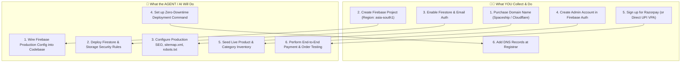

# 🚀 Production Launch Blueprint: Punnagai Toy Store
**Launch Target:** 24 – 48 Hours  
**Total Upfront Budget:** ₹400 – ₹850 (Domain only; Hosting & DB ₹0)

---

## 📊 1. Budget & Provider Comparison (Zero Fluff, Free/Cheapest)

| Service Layer | Recommended Provider | Plan | Upfront Cost | Renewal / Ongoing |
| :--- | :--- | :--- | :--- | :--- |
| **Domain Registrar** | [Spaceship](https://www.spaceship.com) or [Cloudflare Registrar](https://www.cloudflare.com/products/registrar/) | `.in` or `.com` | ~₹400 – ₹850 / yr | ~₹700 – ₹900 / yr |
| **DNS, SSL & DDoS** | [Cloudflare](https://www.cloudflare.com) | Free Tier | **₹0 / Free** | **₹0 / Free** |
| **Web Hosting** | [Firebase Hosting](https://firebase.google.com/docs/hosting) or [Cloudflare Pages](https://pages.cloudflare.com) | Spark / Free Tier | **₹0 / Free** | **₹0 / Free** |
| **Database & Auth** | [Google Firebase](https://console.firebase.google.com) (Firestore + Auth) | Spark (Free Tier) | **₹0 / Free** | **₹0 / Free** (50k reads/day) |
| **Payment Gateway** | [Razorpay](https://razorpay.com) / Direct UPI Intent | Standard PG / UPI | **₹0 Setup** | 2% per txn (Standard PG) / 0% (Direct UPI) |
| **Media Storage** | Firebase Cloud Storage | Free Tier (5 GB) | **₹0 / Free** | **₹0 / Free** |
| **Transactional Alerts**| WhatsApp Direct / Cloud Function | Standard API / Link | **₹0 / Free** | Free for basic volume |

> [!TIP]
> **Why this stack?** You spend strictly on the domain name. Firebase Spark Plan and Cloudflare give enterprise-grade global speeds, automated SSL, zero-downtime hosting, and bank-grade security without a single monthly hosting fee.

---

## 👥 2. Roles & Responsibilities



---

## 🔑 3. Credentials & Information You Need to Collect

Please collect these items and provide them when ready:

### A. Domain Name
* Chosen domain (e.g., `punnagaitoystore.in` or `punnagaitoystore.com`).
* Registrar access or DNS panel (e.g., Cloudflare / Spaceship / GoDaddy).

### B. Firebase Web App Configuration
In [Firebase Console](https://console.firebase.google.com):
1. **Create Project:** Name it `punnagai-toy-store-live`.
2. **Firestore:** Build $\rightarrow$ Firestore Database $\rightarrow$ Create Database in `asia-south1` (Mumbai).
3. **Authentication:** Build $\rightarrow$ Authentication $\rightarrow$ Enable **Email/Password** & **Google**.
4. **App Registration:** Project Settings $\rightarrow$ Add Web App (`</>`) $\rightarrow$ Copy the config snippet:
```javascript
const firebaseConfig = {
  apiKey: "AIzaSy...",
  authDomain: "punnagai-toy-store-live.firebaseapp.com",
  projectId: "punnagai-toy-store-live",
  storageBucket: "punnagai-toy-store-live.appspot.com",
  messagingSenderId: "...",
  appId: "..."
};
```
*(Note: Firebase client keys are public identifiers and safe to paste in frontend code).*

### C. Admin Login
* Create an admin user inside Firebase Authentication $\rightarrow$ Users:
  * **Email:** `admin@punnagaitoystore.com` (or your primary email)
  * **Password:** Secure admin password

### D. Payment Details
* **Option 1 (Fastest / ₹0 Gateway Fee):** Business UPI ID / VPA (e.g., `punnagai@oksbi` or `punnagai@icici`) + WhatsApp confirmation number.
* **Option 2 (Full Gateway):** Razorpay `Key Id` (from Razorpay Dashboard $\rightarrow$ Settings $\rightarrow$ API Keys).

---

## 🛠️ 4. Step-by-Step Launch Procedure (24h Schedule)

### Step 1: Codebase Configuration (Agent Action)
* Paste production Firebase credentials into [`js/firebase-config.js`](file:///e:/Github/Kamaal%20Shop%20Website/js/firebase-config.js).
* Set `USE_LOCAL_MODE = false` to enable live cloud syncing.
* Deploy [`firestore.rules`](file:///e:/Github/Kamaal%20Shop%20Website/firestore.rules) and [`storage.rules`](file:///e:/Github/Kamaal%20Shop%20Website/storage.rules).

### Step 2: Static Deployment (Agent Action)
* Initialize Firebase Hosting in [`firebase.json`](file:///e:/Github/Kamaal%20Shop%20Website/firebase.json):
  ```json
  {
    "hosting": {
      "public": ".",
      "ignore": ["firebase.json", "**/.*", "**/node_modules/**", "functions/**"]
    }
  }
  ```
* Run deploy command: `firebase deploy --only hosting,firestore:rules,storage:rules`.

### Step 3: Connect Custom Domain & SSL (User & Agent Action)
* In Firebase Console $\rightarrow$ **Hosting** $\rightarrow$ **Add Custom Domain** $\rightarrow$ enter `punnagaitoystore.in`.
* Add the DNS records provided by Firebase into your Domain Registrar / Cloudflare DNS:
  * **A Record:** `@` $\rightarrow$ `199.36.158.100`
  * **CNAME Record:** `www` $\rightarrow$ `punnagai-toy-store-live.web.app`
* SSL is provisioned automatically at zero cost.

### Step 4: Product Seeding & Validation (Agent & User Action)
* Log in to `https://punnagaitoystore.in/admin.html` with your Admin Account.
* Review/Edit Toy catalog, images, stock quantities, and prices.
* Place a live ₹1 test order to verify customer receipt, admin dashboard order notification, and cart reset.

---

## 🛡️ 5. Post-Launch & Production Maintenance Guide

### Daily / Weekly Workflow (5 Minutes):
1. **Order Processing:** Log in to `/admin.html` $\rightarrow$ Orders tab $\rightarrow$ Verify payment status $\rightarrow$ Mark order as `Processing` or `Shipped` $\rightarrow$ Enter courier tracking ID.
2. **Catalog & Inventory:** Manage out-of-stock items, launch coupons, and add new toys directly from the admin dashboard without writing code.

### Security & Cost Protections:
* **Row-Level Security:** Firestore rules restrict writes to authenticated admins and validate order shapes.
* **GCP Zero-Cost Budget Alert:** Set a ₹50 / month budget limit in Google Cloud Console with email alerts to ensure free-tier boundaries are never exceeded unexpectedly.
* **Database Backups:** Free automated nightly exports of Firestore collections to Cloud Storage.
